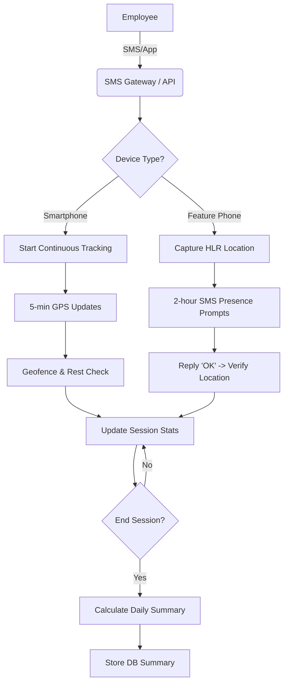

# SMS GPS Attendance System - Workflow Architecture

## Overview
The system provides a unified attendance tracking solution for both **Smartphone users** (via continuous GPS tracking) and **Feature Phone users** (via interactive SMS-based presence checks).

---

## Core Components

### 1. SMS Gateway (TextBee)
- Receives incoming SMS commands (`CHECKIN`, `CHECKOUT`, `STATUS`).
- Sends confirmation messages and periodic presence prompts.
- Connects to the backend via Webhooks.

### 2. Geolocation Engine (Unwired Labs)
- **Smartphone Flow:** Uses device-level high-accuracy GPS coordinates.
- **Feature Phone Flow:** Uses Phone Number (HLR/VLR) lookup to determine coarse location from cell towers.

### 3. Backend Logic (Node.js/Express)
- **Tracking Service:** The brain of the system. Manages sessions, geofence validation, and work period calculations.
- **Presence Worker:** A background cron job that triggers "Are you still at work?" prompts for feature phone users.

### 4. Database (Supabase)
- **PostgreSQL:** Stores employees, tracking sessions, location pings, and daily summaries.
- **Row Level Security (RLS):** Ensures data privacy.

---

## Workflow Architecture



### Detailed Flow Steps:

#### 1. Registration
- Employee is added to the system with a designated work location (Lat/Lng) and a geofence radius (e.g., 200m).
- `device_type` is set to either `smartphone` or `feature`.

#### 2. Check-In (Initialization)
- **Smartphone:** Sends SMS → Gets link → Opens page → Captures GPS → Session Starts.
- **Feature Phone:** Sends SMS → System auto-lookups location → Session Starts.

#### 3. Active Tracking & Monitoring
- **The system maintains continuous state** even during the workday.
- **Rest Intervals:** Managers define break times (e.g., 12:00 PM - 1:00 PM). During these times, location violations are ignored, and tracking is paused to save smartphone battery.
- **Smartphones:** The app/browser sends pings every 5 minutes. If the user leaves the geofence, a "Unauthorized Break" period starts.
- **Feature Phones:** Since they can't send pings in the background, the system **pulls** information by sending an SMS prompt. If the user replies "OK", a location check is performed. If they don't reply, the system assumes an unauthorized absence.

#### 4. Auto-Detection of Unauthorized Breaks
- If a user is detected outside the geofence (and not in a rest interval), the current "Work Period" ends and an "Unauthorized Period" begins.
- When they return, the "Work Period" resumes.
- All these durations are summed up at the end of the day.

#### 5. Check-Out & Finalization
- Manual checkout (SMS or App) ends the tracking session.
- **Presence Score:** Calculated as `Work Time / (Work Time + Unauthorized Time)`.
- **Final Status:** Determined based on `Work Time` and `Presence Score`:
  - `Full Day`: > 7 hours work AND > 85% presence.
  - `Half Day`: > 3.5 hours work AND > 70% presence.
  - `Invalid`: Otherwise.

---

## Concise Project Structure

```text
d:/sms-gps/
├── database/
│   └── complete_schema.sql  <-- Single source of truth for DB
├── docs/
│   ├── ARCHITECTURE.md      <-- System design and workflow
│   ├── API.md               <-- Webhook and Tracking API reference
│   └── DEPLOYMENT.md        <-- Step-by-step production setup
├── src/
│   ├── config/
│   │   └── supabase.js      <-- Connection setup
│   ├── routes/
│   │   ├── admin.routes.js  <-- Employee/REST management
│   │   ├── tracking.routes.js <-- Unified check-in/out logic
│   │   └── webhook.routes.js <-- Incoming SMS handler
│   ├── services/
│   │   ├── tracking.service.js <-- Core logic (merged)
│   │   ├── location.service.js <-- Unwired Labs wrapper
│   │   └── sms.service.js      <-- TextBee wrapper
│   ├── workers/
│   │   └── presence.worker.js  <-- Feature phone cron job
│   ├── utils/
│   │   └── distance.js         <-- Geofencing calculation
│   └── server.js               <-- Application entry point
└── README.md                   <-- General overview
```

---

## Key Benefits
- **Accountability:** Prevents buddy-punching via geofencing.
- **Inclusivity:** Works for both high-end smartphones and basic 2G feature phones.
- **Battery Efficient:** 5-minute intervals and rest-period pausing minimize phone drain.
- **Automated:** Periodic checks ensure continuous presence without user micromanagement.
